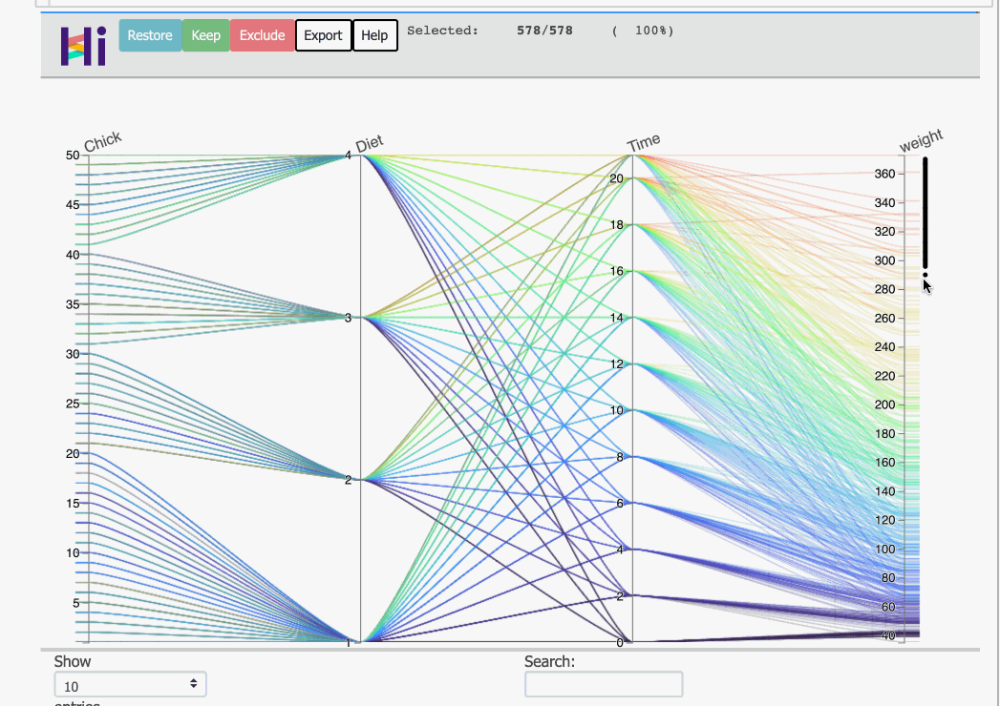

# HiPlot - Better Parallel Co-ordinates
[HiPlot](https://pypi.org/project/hiplot/) is a **very-light interactive** visualisation tool by **Facebook AI 
Research** that allows you to view n-dimensional relationships in a 2 D view and was released very recently.  

While parallel co-ordinates is not a new methodology, and has been around figuratively for more than a century -
[1885](https://en.wikipedia.org/wiki/Parallel_coordinates), the Key Benefits IMO are listed as below.

## Key benefits

* **Interactivity** - highly customisable and fast
    * Zoom in or Zoom out on the dataset - by selecting a particular set of points to **Keep** and to **Exclude**
      respectively.

    - Able to visually transform scales to log-scale and percentile scales
    - Select color axis
    - Re-order columns in column axis (should help in discovery of relationships/corr. b/w variables)
* Scale - Able to handle interactivity w/ around **half a million data points w/o getting sluggish**
* **Looks pretty** and not dull!!! /\

In summary, **discovering the story** (assuming you have all the characters) or **EDA** became a lot easier

Let us build a narrative together and explore the [chicken weight dataset](https://www.rdocumentation.
org/packages/datasets/versions/3.6.2/topics/ChickWeight) to just see what all can we do.

The installation instructions are pretty standard and covered here. A quick command is as below  
```shell
pip install -U hiplot  # Or for conda users: conda install -c conda-forge hiplot
```

## First look at the data in a jupyter notebook

```python
chicks = pd.read_csv('chickweight.csv')  # get the chicks :D
import hiplot as hip

data = chicks.to_dict(orient='records')  # this transforms the chicks into a data dictionary..
hip.Experiment.from_iterable(data).display()  #
```


### Stating the obvious

* **About the dataset**: dataset that has weight measures of chicks for 21 days after they are born given a specific
  diet
* The columns of the **data_frame** are the vertical axes, and given that these axes representing co-ordinates are
  parallel to each other, ergo, **parallel co-ordinates**.
* We'll just re-arrange the dataset so that we understand this a tad bit better and know what, how and where to look for
* We move the `Chick` column as the first column (this is **chick_id**), followed by `Diet` , as this is a different
  feed to the chickens, and our **target variable** is the `weight` of the chicks, which comes to the last, which leaves
  the `time`  columns as the third one. This gives us the following ordering.
  

### Stating the Not so obvious

* The first **numerical** column in the dataset is used for **coloring**. For our case, it was `weight`, which is also
  our target variable, so we don't really need to explicitly set it.
* This parallel co-ordinates view would have automatically handled **categorical** variable of `Diet`. You can easily
  mark a variable categorical if need be(just right-click on the column text at top).

## Free Stuff

### Outlier Detection(Multi-dimensional, yes!)

* At a glance, one can see that the extreme weights of chicks are in the **range >300**.
* Selecting records will highlight the row and associated values of different columns.
  
* An added advantage is, you could see the multi-dimensional outliers in a glance here.
* You can **exclude** them, by just clicking on the **Exclude** button and the plot would **re-scale** if needed

### Helping us ask the questions

* It does not take a very fine eye to note the following for the last 2 variables - `Time` and `Weight`
    * The **weight** of the chickens do seem to **increase w/ time** (given the lines look parallel to each other w.r.t
      time) and the change in color
    * We also observe there is an **increase in variance** as the time increases. We could confirm this by looking at
      time vs weight plot. Guess what, you can do it right here!!
      

### Multi-Variate Relationships

* A very powerful thing that we can do is, we can select a window of one or more column and observe the association w/
  target variable.
* Here, we obviously ask, for a set of 2 different diets say **Diet 2**, and **Diet 3**, **how does the weight of
  chickens change with respect to time window of days?**.
    * Here, we first **color by Diet** variable to get a sense of differentiation b/w two diets.
    * Select the `Diet` we wish to compare, and simply, select the rolling timeframe
    * We move the **weight axes now in the center**, to observe the growth of chicken w/ time.
    * The following view, then allows us to think in the direction that **Diet 3** fosters more growth than **Diet 2**
      

## Additional Features

* **Export as interactive html**: One can easily export this as a standalone html to explore the dataset using just the
  csv. You can even share the html offline. The command for the same is

```shell
hiplot-render chickweight.csv > chickweight.html
```

* **DataFrame Access**: It's easy to get lost in plots and charts, and a lot of us tend to stick to tables. There is
  **searchable dataframe** right below the plot to enable access the entire dataframe content right at the bottom.
* **Variable Transformation** :Hi-Plot visual allows us to do few very useful transformations on the fly, including b/w
  types(categorical, numerical, timestamp) and Scale - (Log, Percentiles)

## Limitations and Things to Note

* If you took a note above(Multi-variate - relationships), we did **center** the weight axis and had the **Time** and
  **Diet** around it. This was for the purpose that it is easier to identify relationships b/w adjoining columns, and it
  gets difficult as we move away from the columns.
* This view will definitely help us to get started w/ discovering the story, but might not necessarily help us have an
  exhaustive view. A good example of that is that we did miss the fact that some chickens in the above dataset **
  prematurely died**
* Another thing to note, that discovering the order in which to view data might need a few iterations and might not be
  very obvious for a dataset having a lot of features. Do give a read to [wiki](https://en.wikipedia.org/wiki/Parallel_coordinates) for better usage from the parallel 
  coordinates view.

## Sources
* [HiPlot](https://pypi.org/project/hiplot/)
* [Parallel Co-ordinates Wiki](https://en.wikipedia.org/wiki/Parallel_coordinates)
* [Chicken Dataset](https://www.rdocumentation.org/packages/datasets/versions/3.6.2/topics/ChickWeight)
* [Chicken Dataset for Python](https://calmcode.io/datasets/chickweight.html)
* (Warmerdam (2021, Sept. 2). koaning.io: Bad Labels. Retrieved from https://koaning. io/posts/labels/)